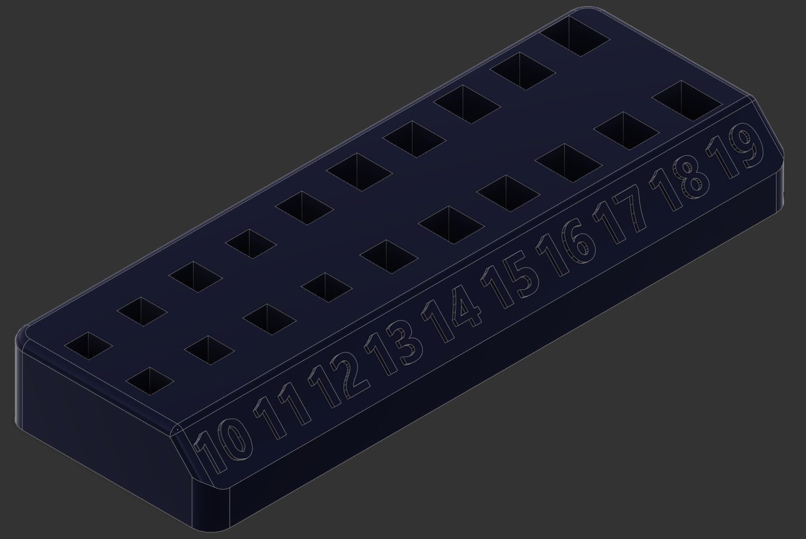
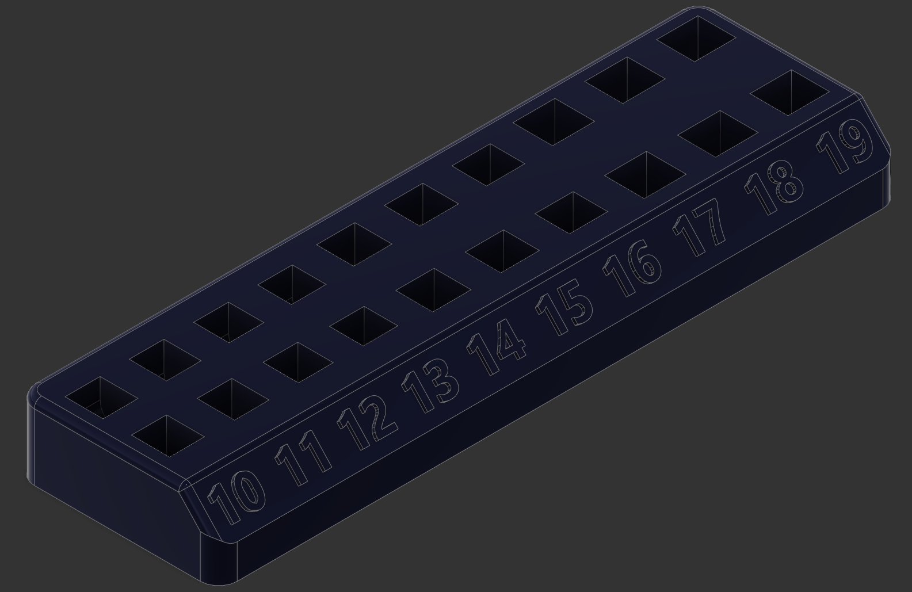
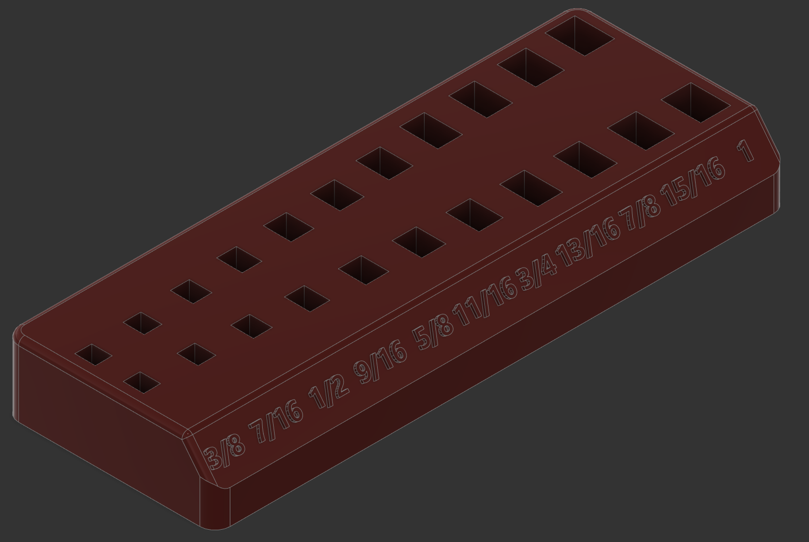
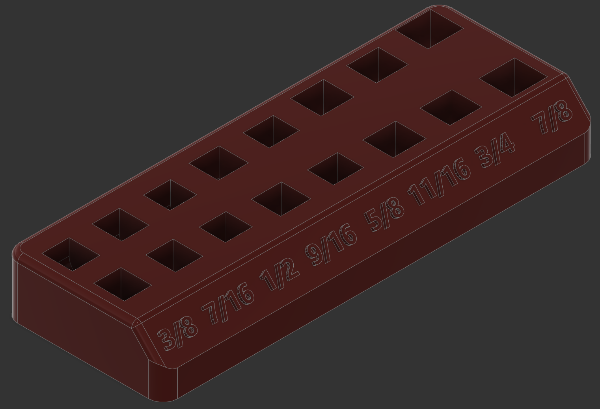
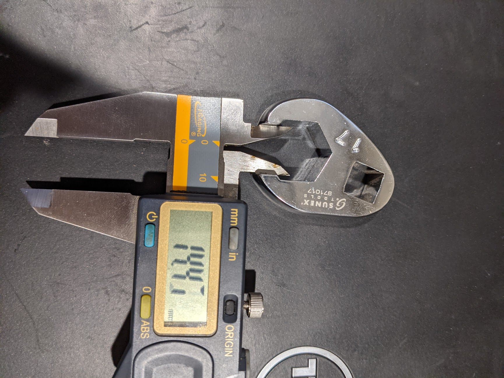
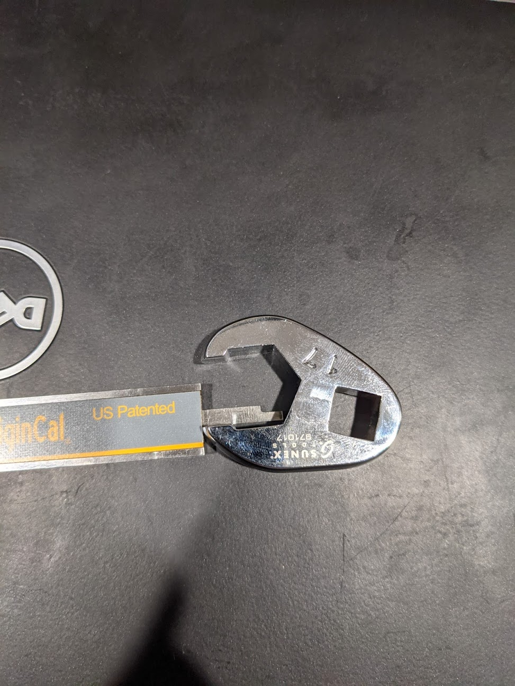
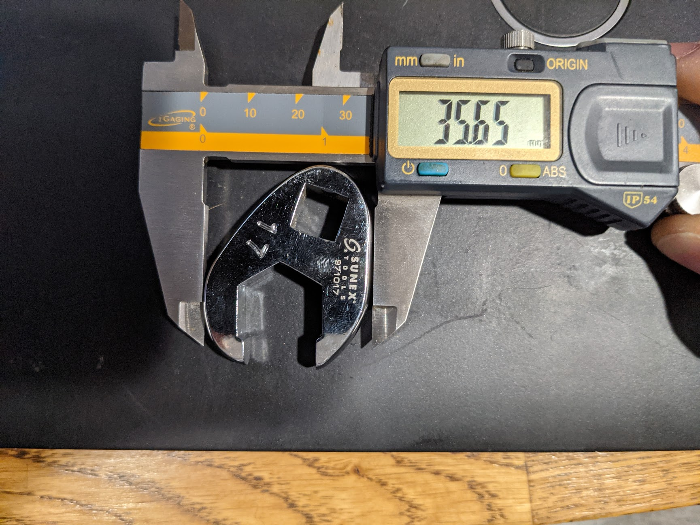
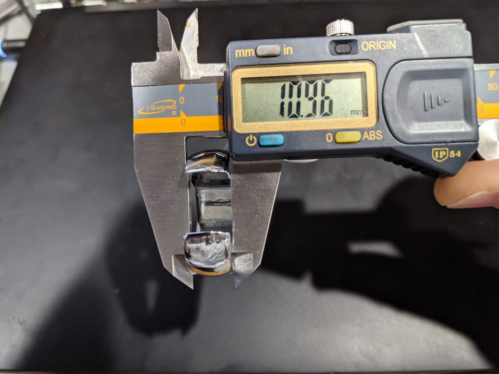

# Rack for Crowsfoot & Flare Nut socket wrenches

Printed rack for crowsfoot & flare nut socket wrenches

- SAE Flare nut wrenches: [Sunex 9708](https://www.zoro.com/sunex-tools-38-drive-sae-crowfoot-wrench-set-8-pcs-38-drve-8-pcs-9708/i/G2314151)  
- Metric Flare nut wrenches: [Sunex 9710M](https://www.zoro.com/sunex-tools-metric-flare-nut-wrench-set-38-in-10-pc-9710m/i/G4514645/)
- SAE crowsfoot wrenches: [Gearwrench 81908](https://smile.amazon.com/gp/product/B000NIAJZA/)
- Metric crowsfoot wrenches: [Gearwrench 81909](https://smile.amazon.com/gp/product/B000NI93V6/)

Design driven from measurements into parameter variables in F360.  Measured throat opening, depth, thickness, and width.  Pics below showing measurement method.

I ordered these [Magnets from amazon](https://smile.amazon.com/gp/product/B07MV6M12H) to see if the rack benefits, but the wrenches are pretty heavy, so may not be necessary.  As of 2/17/2021, have not received or tested.

# Changelog

2021/02/17 - Initial commit
2021/03/22 - Update with final designs

## Design

Autocad Fusion 360 

## Slicer

Ultimaker Cura 4.8.0
- Printer: Creality CR6 SE
- Layer Height: 0.2mm
- Infill Density: 10%
- Infill Pattern: Grid
- Filament: Inland PLA+ 1.75mm (RED = SAE, BLUE = Metric)
- Material: PLA+
- Print Temperature: 215 degrees C

# Preview

# Measurements

